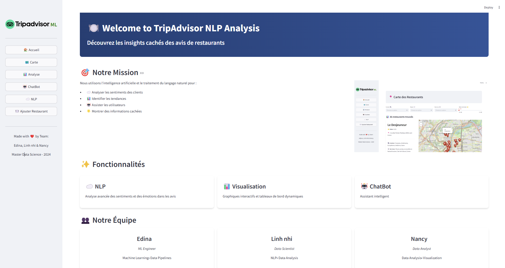
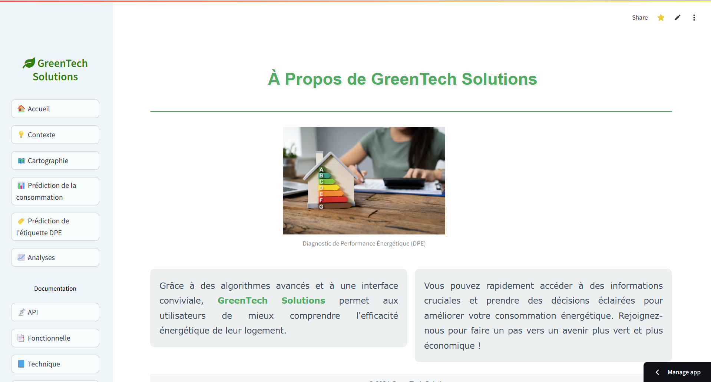
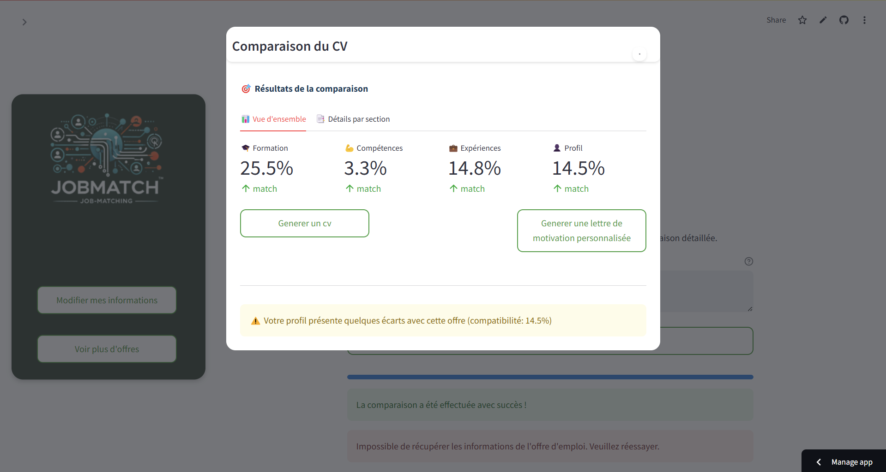
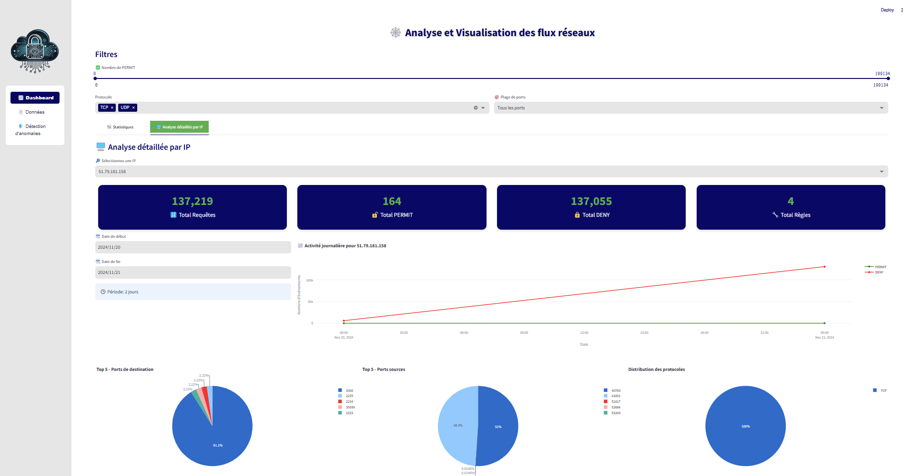
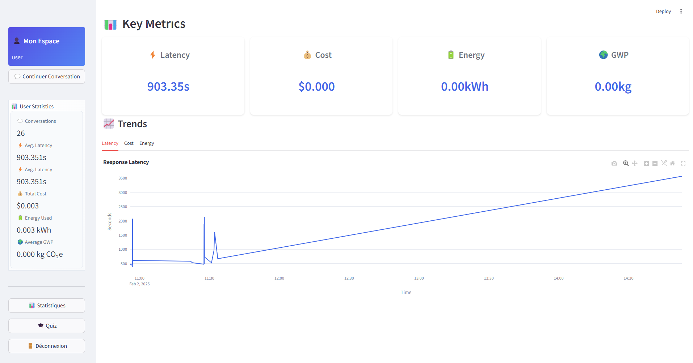
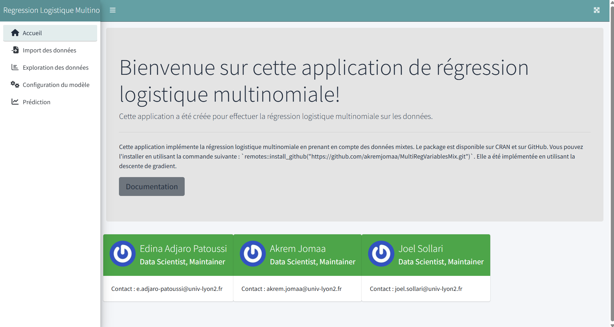

<h1 align="center">Hi there, I'm Edina Adjaro Patoussi 👋</h1>
<h3 align="center">Data Scientist · Machine Learning / Deep Learning · MLOps</h3>

  
  
  
  
  

---

## 🧑‍💻 About me

Master 2 student in **Data Science (SISE)** at Université Lyon 2 Lumière, with a strong focus on **machine learning**, **deep learning** (computer vision) and **MLOps**. I enjoy turning raw data into reliable, production-ready systems — from data collection and modeling to containerized deployment.

- 🎓 Currently completing my **M2 SISE — Statistique & Informatique** at Université Lyon 2
- 🔭 Working on projects around **Computer Vision**, **NLP / LLMs** and **MLOps pipelines**
- 🧪 Previously **Data Science intern** at **LIRIS Lab (Lyon)** — Detectron2, OCR, model evaluation
- 🌱 Continuously learning **cloud-native ML deployment** and **distributed training**
- 📍 Based in **Lyon, France** — open to opportunities
- 📫 Reach me at **adjaropatoussi@gmail.com**

---

## 🛠 Tech stack

#### Languages

  
  
  
  
  
  
  

#### Machine Learning, Deep Learning & Data

  
  
  
  
  
  
  
  
  
  

#### MLOps, Cloud & Databases

  
  
  
  
  
  
  
  

#### Web, Apps & Visualization

  
  
  
  
  
  

---

## 🚀 Featured projects

<table>
  <tr>
    <td width="50%" valign="top">
      
      <h4>🍽️ TripAdvisor NLP Analysis</h4>
      
End-to-end NLP app analyzing Lyon restaurant reviews: scraping (BeautifulSoup), sentiment clustering, SQLite, LLM + RAG summarization. Streamlit app deployed with Docker.

      

        
        
        
        
      

      <a href="https://github.com/Adjaro/TripAdvisor-NLP-Analysis"><b>→ View repo</b></a>
    </td>
    <td width="50%" valign="top">
      
      <h4>🌱 GreenTech Solutions — DPE</h4>
      
Energy Performance Diagnosis app on French housing data: consumption prediction, DPE label classification, interactive cartography. Built for the Enedis use case.

      

        
        
        
      

      <a href="https://github.com/Adjaro/M2_ENEDIS"><b>→ View repo</b></a>
    </td>
  </tr>
  <tr>
    <td width="50%" valign="top">
      
      <h4>🎯 JobMatch — CV ↔ Offer matching</h4>
      
AI-powered job-matching app that compares a candidate profile to a job offer (training, skills, experience, profile) and generates a tailored CV and cover letter.

      

        
        
        
      

      <a href="https://github.com/Adjaro/challenge_ia_m2_sise"><b>→ View repo</b></a>
    </td>
    <td width="50%" valign="top">
      
      <h4>🛡️ Network Flow Analysis & Anomaly Detection</h4>
      
Interactive dashboard analyzing 199k+ firewall events: per-IP drill-down, PERMIT/DENY trends, top ports, protocol distribution and anomaly detection.

      

        
        
        
      

      <a href="https://github.com/Adjaro/Challenge_securite"><b>→ View repo</b></a>
    </td>
  </tr>
  <tr>
    <td width="50%" valign="top">
      
      <h4>♻️ RePilot — Recycling LLM Chatbot</h4>
      
LLM-based chatbot giving recycling rules per French city, with a quiz module and a monitoring dashboard tracking latency, cost, energy use and GWP (CO₂e) per conversation.

      

        
        
        
      

      <a href="https://github.com/Adjaro/RePilot-recycle-chatbot"><b>→ View repo</b></a>
    </td>
    <td width="50%" valign="top">
      
      <h4>📦 Multinomial Logistic Regression — R package</h4>
      
R package implementing multinomial logistic regression from scratch: multiple optimizers, regularization, up to ~90% accuracy on the StudentPerformance dataset.

      

        
        
      

      <a href="https://github.com/akremjomaa/MultiReglatableMRb"><b>→ View repo</b></a>
    </td>
  </tr>
</table>

> Other notable repos: <a href="https://github.com/Adjaro/Olist_DataWarehouse_Azure">Olist Data Warehouse (Azure)</a> · <a href="https://github.com/Adjaro/airflow_td">Airflow pipelines</a>

---

## 🎓 Education

- **M2 — Statistique & Informatique (SISE)** · Université Lyon 2 Lumière · *Since Sept. 2023*
   ANOVA, time series, biostatistics, NLP / LLM, computer vision, Big Data & MLOps.
- **M1 — Artificial Intelligence & Big Data** · École Polytechnique de Lomé + UTBM · *Oct. 2022 – Aug. 2023*
   Python OOP, data engineering, advanced databases, supervised learning, SAS, algorithmic complexity.

## 💼 Experience

- **Data Science Intern** · *LIRIS Laboratory, Lyon* · Apr. 2024 – Aug. 2024
   Computer vision with **Detectron2**, data annotation & augmentation, OCR/OLR experimentation, model evaluation, technical reporting.
- **Web & Mobile Developer** · *IT Innovation, Lomé* · Apr. 2022 – Sept. 2022
   Mobile/web development, Chart.js dashboards, database design and optimization.

## 📜 Certifications

- **Associate Data Scientist in Python** — DataCamp
- **Back-End Engineering** — Lyft (Forage)

## 🌍 Languages

`French — Native`  ·  `English — Intermediate`

---

## 📊 GitHub stats

  
  

  

  

---

<i>Open to internships, collaborations and discussions around Data Science, Computer Vision, NLP and MLOps.</i>

